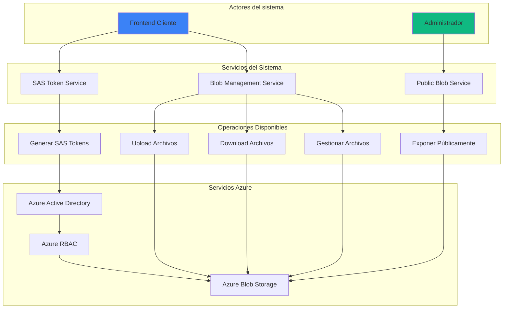

<div>
    
</div>

# pendig-seguridad-ms-sas-generator-nodejs

**Autor:** [Juan Camilo Bazurto](https://github.com/POR18686_porvenir)

[](https://nodejs.org/)
[](https://www.typescriptlang.org/)
[](https://www.npmjs.com/)
[](https://nestjs.com/)

## **Introducción**

Este proyecto implementa un ecosistema completo de servicios backend para la gestión segura de Azure Blob Storage, incluyendo generación de SAS Tokens, operaciones CRUD de archivos, y gestión de contenedores públicos y privados. Utiliza autenticación con Azure Active Directory (Azure AD) y delegación de usuario (User Delegation Key) para proporcionar un mecanismo centralizado y seguro para el manejo de blobs.

### **Información del servicio**

- **Nombre del servicio:** pendig-seguridad-ms-sas-generator-nodejs
- **Lenguaje:** Node.js (20.x), TypeScript
- **Framework:** NestJS con Express
- **Almacenamiento:** Azure Blob Storage
- **Seguridad:** Azure AD + RBAC (Storage Blob Delegator + Reader)

### **Descripción**

Este servicio proporciona una API RESTful completa para:

- **Generación de SAS Tokens:** URLs temporales firmadas para acceso seguro a blobs
- **Gestión de Archivos:** Upload, download, delete, move, copy de archivos
- **Soporte Multiformat:** Archivos multipart y Base64
- **Contenedores Públicos:** Exposición temporal de archivos para acceso público
- **Validación Avanzada:** Tipos MIME, tamaños de archivo y extensiones
- **Seguridad:** Restricciones por IP, tiempo de expiración y permisos granulares

### **Servicios Disponibles**

#### 🔐 **SAS Token Generator**

- Generación de URLs firmadas temporales
- Autenticación con Azure AD
- Restricciones por IP y tiempo
- User Delegation Key para máxima seguridad

#### 📁 **Blob Storage Management**

- Upload de archivos (multipart/Base64)
- Download de archivos (binario/Base64)
- Operaciones de archivo (move, copy, delete)
- Listado de contenedores y directorios

#### 🌐 **Public Blob Exposure**

- Exposición temporal de archivos privados
- Generación de URLs públicas con expiración
- Soporte para contenedores públicos

### **Especificaciones Técnicas**

#### **Tecnología utilizada**

- **Lenguaje:** Node.js 20.x + TypeScript 5.x
- **Framework:** NestJS con Express.js
- **Autenticación:** Azure Active Directory (@azure/identity)
- **Cliente de Storage:** @azure/storage-blob
- **Documentación:** Swagger/OpenAPI
- **Testing:** Jest
- **Validación:** class-validator, class-transformer

#### **Servicios de Azure involucrados**

- **Azure Blob Storage**
- **Azure Active Directory (App Registration)**
- **Azure Role-Based Access Control (RBAC):**
  - Storage Blob Delegator a nivel de cuenta
  - Storage Blob Data Reader a nivel de contenedor
  - Storage Blob Data Contributor para operaciones de escritura

#### **Características adicionales**

- Validación de tipos MIME permitidos
- Límites de tamaño de archivo configurables (6MB por defecto)
- Soporte para directorios virtuales
- Generación de identificadores únicos de solicitud
- Logging detallado de operaciones
- Manejo robusto de errores
- Documentación automática con Swagger

### **Descripción Funcionalidad del Servicio**

El proyecto se organiza en múltiples controladores especializados:

#### **1. SAS Controller (`/sas`)**

Maneja la generación de tokens de acceso seguro:

- **Generación por URL:** Recibe una URL de blob y genera un SAS token
- **Generación parametrizada:** Permite especificar contenedor, archivo, permisos y duración
- **Validación de IP:** Restringe el acceso por dirección IP del cliente
- **Expiración configurable:** Tokens válidos por tiempo específico

#### **2. Blob Storage Controller (`/blob`)**

Gestiona todas las operaciones CRUD de archivos:

- **Upload:** Subida de archivos multipart o Base64
- **Download:** Descarga en formato binario o Base64
- **Delete:** Eliminación segura de archivos
- **Move/Copy:** Reorganización de estructura de archivos
- **List:** Listado de archivos por contenedor o directorio

#### **3. Public Blob Management**

Exposición temporal de archivos privados:

- **Expose Public:** Convierte archivos privados en URLs públicas temporales
- **List Public:** Lista archivos disponibles en contenedores públicos
- **Time-based Expiration:** URLs que expiran automáticamente

### **Diagramas del Sistema**

#### **1. Diagrama de contexto**



#### **2. Estructura de archivos**

```
└── 📁pendig-seguridad-ms-sas-generator-nodejs
    └── 📁src
        └── 📁controllers
            └── 📁__tests__
                └── sas.controller.test.ts
                └── blob-storage.controller.test.ts
            └── sas.controller.ts
            └── blob-storage.controller.ts
        └── 📁services
            └── 📁__mocks__
                └── sas.service.ts
                └── blob-storage.service.ts
                └── file-validation.service.ts
            └── sas.service.ts
            └── blob-storage.service.ts
            └── file-validation.service.ts
        └── 📁shared
            └── 📁dto
                └── generate-sas-token.dto.ts
                └── upload-blob.dto.ts
                └── download-blob.dto.ts
                └── delete-blob.dto.ts
                └── copy-blob.dto.ts
                └── move-blob.dto.ts
                └── expose-public-blob.dto.ts
                └── list-blobs.dto.ts
            └── 📁enums
                └── error-messages.enum.ts
                └── http-status-codes.enum.ts
            └── 📁exceptions
                └── bad-request.exception.ts
            └── 📁decorators
                └── swagger-responses.decorator.ts
        └── 📁common
            └── 📁utils
                └── ip-validation.util.ts
                └── url-parser.util.ts
        └── 📁routes
            └── sas.routes.ts
            └── blob.routes.ts
        └── app.module.ts
        └── main.ts
    └── 📁test
        └── app.e2e-spec.ts
    └── .env.development
    └── .env.production
    └── .env.qa
    └── nest-cli.json
    └── package.json
    └── tsconfig.json
    └── README.md
```

## **Documentación de Endpoints**

### **SAS Token Generator**

#### **Generar SAS Token por URL**

| **Campo**       | **Valor**                                                               |
| --------------- | ----------------------------------------------------------------------- |
| **Endpoint**    | `POST /sas/generate-sas-url`                                            |
| **Descripción** | Genera una URL con SAS Token para acceder a un archivo específico       |
| **Headers**     | `x-forwarded-for: <IP_del_cliente>`                                     |
| **Body**        | `{ "url": "https://storage.blob.core.windows.net/container/file.pdf" }` |

**Respuesta exitosa:**

```json
{
  "status": {
    "statusCode": 200,
    "statusDescription": "Operación completada con éxito."
  },
  "data": {
    "sasUrl": "https://storage.blob.core.windows.net/container/file.pdf?sv=2024-04-03...",
    "sasToken": "sv=2024-04-03&st=2024-04-03T18:00:00Z...",
    "permissions": "r",
    "expiresOn": "2024-04-03T18:05:00Z",
    "containerName": "uploads",
    "blobName": "file.pdf",
    "requestId": "1234567890-abc123def"
  }
}
```

#### **Generar SAS Token Parametrizado**

| **Campo**       | **Valor**                                                                                                  |
| --------------- | ---------------------------------------------------------------------------------------------------------- |
| **Endpoint**    | `POST /sas/generate-sas-token`                                                                             |
| **Descripción** | Genera un SAS Token con parámetros específicos                                                             |
| **Body**        | `{ "containerName": "uploads", "fileName": "document.pdf", "permissions": "rw", "expirationMinutes": 60 }` |

### **Blob Storage Management**

#### **Upload de Archivos**

##### **Upload Multipart**

| **Campo**        | **Valor**                                             |
| ---------------- | ----------------------------------------------------- |
| **Endpoint**     | `POST /blob/upload`                                   |
| **Content-Type** | `multipart/form-data`                                 |
| **Descripción**  | Sube un archivo usando multipart/form-data (máx. 6MB) |

**Form Data:**

```
file: [archivo_binario]
containerName: uploads
blobName: documento.pdf
directory: documentos/2024
```

##### **Upload Base64**

| **Campo**        | **Valor**                                       |
| ---------------- | ----------------------------------------------- |
| **Endpoint**     | `POST /blob/upload/base64`                      |
| **Content-Type** | `application/json`                              |
| **Descripción**  | Sube un archivo codificado en Base64 (máx. 6MB) |

**Body:**

```json
{
  "containerName": "uploads",
  "blobName": "documento.pdf",
  "directory": "documentos/2024",
  "fileBase64": "JVBERi0xLjQKMSAwIG9iago8PAovVHlwZSAvQ2F0YWxvZwo...",
  "mimeType": "application/pdf"
}
```

#### **Download de Archivos**

##### **Download Binario**

| **Campo**       | **Valor**                              |
| --------------- | -------------------------------------- |
| **Endpoint**    | `POST /blob/download`                  |
| **Response**    | `application/octet-stream`             |
| **Descripción** | Descarga un archivo en formato binario |

##### **Download Base64**

| **Campo**       | **Valor**                                |
| --------------- | ---------------------------------------- |
| **Endpoint**    | `POST /blob/download/base64`             |
| **Response**    | `application/json`                       |
| **Descripción** | Descarga un archivo codificado en Base64 |

#### **Gestión de Archivos**

##### **Eliminar Archivo**

| **Campo**       | **Valor**                             |
| --------------- | ------------------------------------- |
| **Endpoint**    | `POST /blob/delete`                   |
| **Descripción** | Elimina un archivo del almacenamiento |

##### **Mover Archivo**

| **Campo**       | **Valor**                              |
| --------------- | -------------------------------------- |
| **Endpoint**    | `POST /blob/move`                      |
| **Descripción** | Mueve un archivo a una nueva ubicación |

**Body:**

```json
{
  "containerName": "uploads",
  "sourceBlobPath": "temporal/documento.pdf",
  "destinationBlobPath": "documentos/2024/documento-final.pdf"
}
```

##### **Copiar Archivo**

| **Campo**       | **Valor**                              |
| --------------- | -------------------------------------- |
| **Endpoint**    | `POST /blob/copy`                      |
| **Descripción** | Copia un archivo a una nueva ubicación |

#### **Listado de Archivos**

##### **Listar Archivos en Contenedor**

| **Campo**       | **Valor**                                 |
| --------------- | ----------------------------------------- |
| **Endpoint**    | `POST /blob/list`                         |
| **Descripción** | Lista todos los archivos en un contenedor |

##### **Listar Archivos en Directorio**

| **Campo**       | **Valor**                                  |
| --------------- | ------------------------------------------ |
| **Endpoint**    | `POST /blob/list/directory`                |
| **Descripción** | Lista archivos en un directorio específico |

### **Public Blob Management**

#### **Exponer Archivo Públicamente**

| **Campo**       | **Valor**                                             |
| --------------- | ----------------------------------------------------- |
| **Endpoint**    | `POST /blob/expose-public`                            |
| **Descripción** | Crea una URL pública temporal para un archivo privado |

**Body:**

```json
{
  "containerName": "uploads",
  "blobName": "documento.pdf",
  "directory": "documentos/confidenciales",
  "expirationMinutes": 60,
  "base64": false
}
```

**Respuesta:**

```json
{
  "status": {
    "statusCode": 200,
    "statusDescription": "Operación completada con éxito."
  },
  "data": {
    "sasToken": "sv=2024-04-03&st=2024-04-03T18:00:00Z...",
    "sasUrl": "https://publicstore.blob.core.windows.net/public/documento.pdf?sv=...",
    "permissions": "r",
    "expiresOn": "2024-04-03T19:00:00Z",
    "contentType": "application/pdf",
    "containerName": "uploads",
    "blobName": "documento.pdf",
    "fullPath": "documentos/confidenciales/documento.pdf",
    "size": 1048576,
    "requestId": "123e4567-e89b-12d3-a456-426614174000"
  }
}
```

#### **Listar Archivos Públicos**

| **Campo**       | **Valor**                                           |
| --------------- | --------------------------------------------------- |
| **Endpoint**    | `POST /blob/list-public`                            |
| **Descripción** | Lista archivos disponibles en el contenedor público |

## **Validaciones y Restricciones**

### **Tipos de Archivo Soportados**

- **Documentos:** PDF, Word (.doc, .docx), Excel (.xls, .xlsx), PowerPoint (.ppt, .pptx), TXT, CSV
- **Imágenes:** JPEG, PNG, GIF, BMP, WebP, SVG
- **Audio:** MP3, WAV
- **Video:** MP4, AVI, QuickTime
- **Comprimidos:** ZIP, RAR, 7Z
- **Datos:** JSON, XML

### **Límites de Tamaño**

- **Máximo por archivo:** 6MB
- **Validación automática:** Para uploads multipart y Base64
- **Compresión recomendada:** Para archivos grandes

### **Seguridad**

- **Autenticación:** Azure AD obligatoria
- **Autorización:** RBAC con roles específicos
- **Restricciones IP:** Opcional por endpoint
- **Expiración:** Tokens temporales con duración configurable
- **Validación:** Tipos MIME y extensiones de archivo

## **Configuración**

### **Variables de Entorno**

```bash
# Azure Storage
AZURE_STORAGE_ACCOUNT_NAME=your_storage_account
AZURE_STORAGE_CONTAINER_NAME=your_container

# Azure AD
AZURE_CLIENT_ID=your_client_id
AZURE_CLIENT_SECRET=your_client_secret
AZURE_TENANT_ID=your_tenant_id

# Configuración de la aplicación
PORT=3000
NODE_ENV=development
MAX_FILE_SIZE_MB=6

# Contenedor público (opcional)
PUBLIC_CONTAINER_NAME=public
```

### **Instalación y Ejecución**

```bash
# Instalar dependencias
npm install

# Desarrollo
npm run start:dev

# Producción
npm run build
npm run start:prod

# Tests
npm run test
npm run test:e2e
```

## **Ejemplos de Uso**

### **Ejemplo 1: Subir y generar SAS Token**

```bash
# 1. Subir archivo
curl -X POST http://localhost:3000/blob/upload \
  -F "file=@documento.pdf" \
  -F "containerName=uploads" \
  -F "blobName=mi-documento.pdf" \
  -F "directory=documentos/2024"

# 2. Generar SAS Token
curl -X POST http://localhost:3000/sas/generate-sas-url \
  -H "Content-Type: application/json" \
  -H "x-forwarded-for: 192.168.1.1" \
  -d '{"url": "https://storage.blob.core.windows.net/uploads/documentos/2024/mi-documento.pdf"}'
```

### **Ejemplo 2: Exponer archivo públicamente**

```bash
curl -X POST http://localhost:3000/blob/expose-public \
  -H "Content-Type: application/json" \
  -d '{
    "containerName": "uploads",
    "blobName": "reporte-confidencial.pdf",
    "directory": "reportes/2024",
    "expirationMinutes": 30,
    "base64": false
  }'
```

### **Ejemplo 3: Gestión de archivos**

```bash
# Mover archivo
curl -X POST http://localhost:3000/blob/move \
  -H "Content-Type: application/json" \
  -d '{
    "containerName": "uploads",
    "sourceBlobPath": "temporal/borrador.pdf",
    "destinationBlobPath": "final/documento-aprobado.pdf"
  }'

# Listar archivos en directorio
curl -X POST http://localhost:3000/blob/list/directory \
  -H "Content-Type: application/json" \
  -d '{
    "containerName": "uploads",
    "directory": "final"
  }'
```

## **Documentación API**

La documentación completa de la API está disponible a través de Swagger UI:

```
http://localhost:3000/sas/v1/swagger-ui
```

Esta documentación incluye:

- Especificaciones detalladas de todos los endpoints
- Esquemas de request y response
- Ejemplos interactivos
- Códigos de error y respuestas
