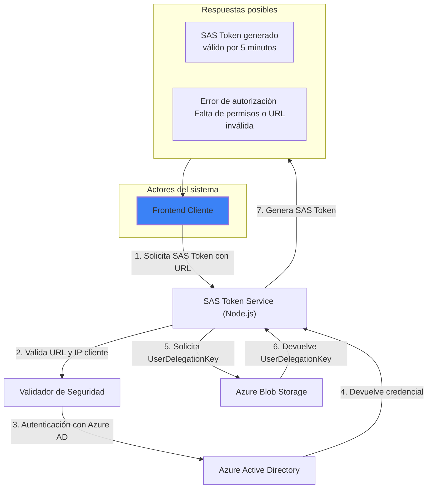
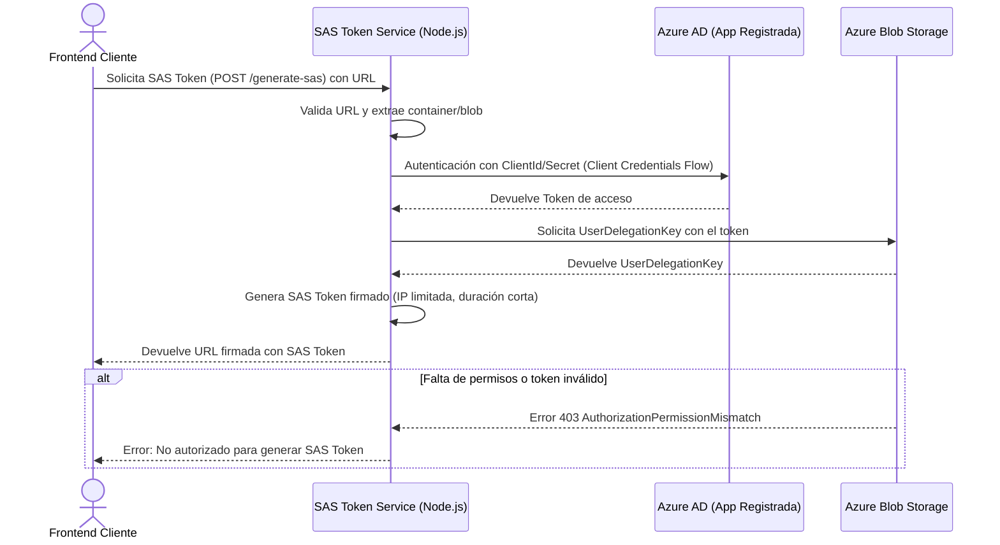
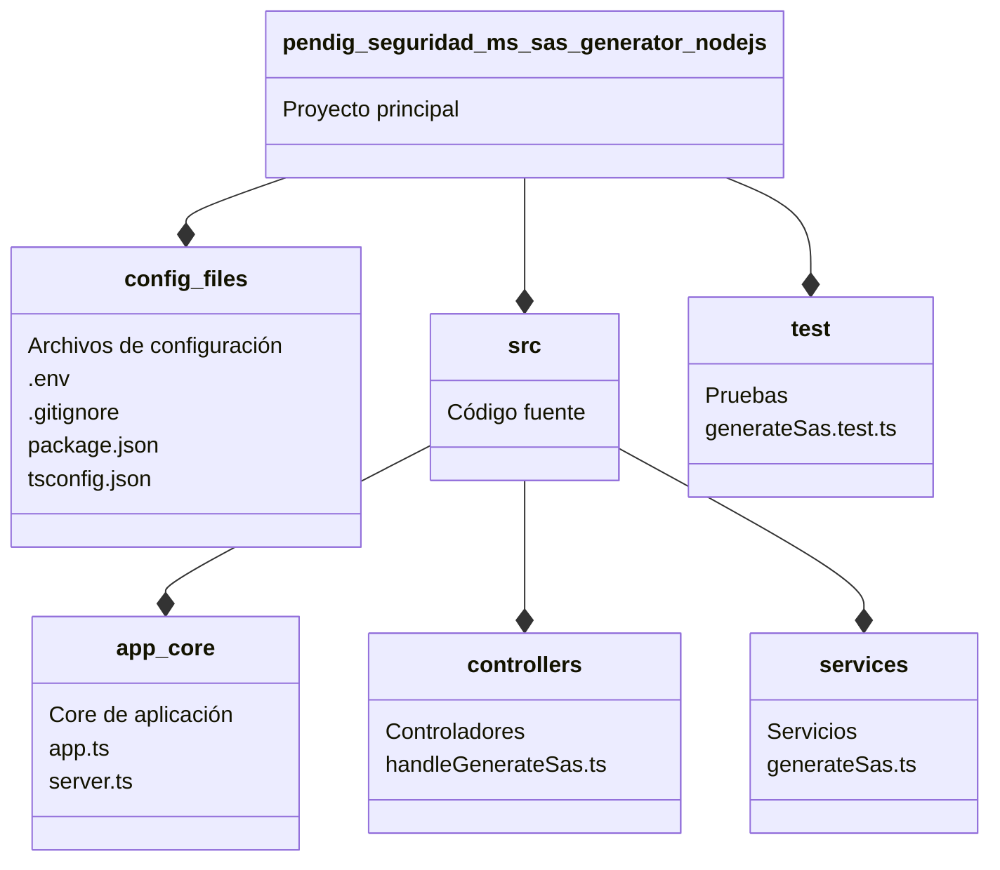

<div>
    
</div>

# pendig-seguridad-ms-sas-generator-nodejs

**Autor:** [Juan Camilo Bazurto](https://github.com/POR18686_porvenir)

[](https://nodejs.org/)
[](https://www.typescriptlang.org/)
[](https://www.npmjs.com/)

## **Introducción**

Este proyecto implementa un servicio backend para la generación segura de SAS Tokens en Azure Blob Storage, utilizando autenticación con Azure Active Directory (Azure AD) y delegación de usuario (User Delegation Key). Su objetivo es proveer un mecanismo centralizado para acceder a blobs protegidos mediante tokens temporales firmados, sin exponer credenciales sensibles en el frontend.

### **Informacion del servicio**

- **Nombre del servicio:** pendig-seguridad-ms-sas-generator-nodejs

- **Lenguaje:** Node.js (20.x), TypeScript

- **Framework:** Express

- **Almacenamiento:** Azure Blob Storage

- **Seguridad:** Azure AD + RBAC (Storage Blob Delegator + Reader)

### **Descripción**

- **Funcionalidad Principal:** Este servicio genera URLs temporales firmadas (SAS Tokens) para acceder de forma segura a archivos almacenados en Azure Blob Storage.

- **Propósito:** Proteger el acceso a blobs restringiendo el tiempo, IP y permisos mediante SAS Tokens generados a partir de credenciales autenticadas con Azure Active Directory.

- **Seguridad:** Utiliza autenticación basada en Azure AD y delegación de permisos con UserDelegationKey, sin exponer claves de acceso a nivel de cuenta.

- **Restricciones configurables:** Tiempo de expiración, dirección IP, tipo de operación (lectura).

### **Especificaciones Técnicas**

#### **Tecnología a utilizar**

- Lenguaje de Programación: Node.js 20.x + TypeScript 5.x

- Framework: Express.js

- Autenticación: Azure Active Directory (@azure/identity)

- Cliente de Azure Storage: @azure/storage-blob

#### **Servicios de Azure involucrados**

- Azure Blob Storage

- Azure Active Directory (App Registration)

- Azure Role-Based Access Control (RBAC):

- Storage Blob Delegator a nivel de cuenta

- Storage Blob Data Reader a nivel de contenedor

#### **Características adicionales**

- Generación de SAS tokens con UserDelegationKey de manera segura

- Soporte para restricción de IP (ipRange)

- Tokens válidos por tiempo corto (configurable)

### **Descripción Funcionalidad del Servicio**

El proyecto se divide en dos componentes principales:

1. **Solicitud de SAS Token:**
   A través de un endpoint expuesto, el frontend puede solicitar un SAS Token proporcionando únicamente la URL del blob de destino. El servicio se encarga de:

- Validar el formato de la URL

- Extraer el contenedor y nombre del blob

- Generar un token temporal utilizando UserDelegationKey autenticado vía Azure AD

- Restringir el acceso opcionalmente por IP del cliente

2. **Generación del SAS Token con seguridad delegada:**
   Se usa la librería oficial de Azure (@azure/storage-blob) y un cliente autenticado vía ClientSecretCredential para solicitar un UserDelegationKey. Este token es firmado bajo los permisos y duración definidos (lectura por 5 minutos, por ejemplo), y devuelto al cliente para ser utilizado en el acceso directo al blob.

Este enfoque permite:

- Control granular de acceso a blobs

- Expiración automática del token

- Evitar exposición de claves de cuenta

- Aplicación de políticas de red (IP) y tiempo

Además, si el cliente no cuenta con el rol de Storage Blob Data Reader en el contenedor, aunque tenga un SAS token válido, no podrá acceder al blob, añadiendo una capa de seguridad adicional.

#### **1. Diagrama de contexto**

El siguiente diagrama de contexto ilustra cómo se genera un SAS Token a partir de una solicitud desde el frontend. Se incluyen validaciones de seguridad como control de IP y permisos de acceso, y se refleja el uso de Azure AD para autenticación y autorización sobre el Storage Account.

El sistema contempla dos posibles respuestas:

- **SAS Token válido:** Devuelto al cliente si cumple con las políticas y permisos requeridos.

- **Error de autorización:** Se retorna si el usuario o la aplicación no cuenta con los roles adecuados o si la URL del blob es inválida.



#### **2. Diagrama de sequencia**

Este diagrama de secuencia muestra la interacción temporal entre el frontend, el servicio SAS Token y los componentes de Azure necesarios para generar un SAS Token seguro.

Se representa todo el flujo desde la solicitud de URL firmada hasta su entrega, incluyendo validaciones, autenticación con Azure AD y uso del servicio de blobs.



#### **3. Diagrama de paquetes**

Este diagrama de paquetes representa la estructura organizativa del proyecto pendig-seguridad-ms-sas-generator-nodejs, el cual está desarrollado en Node.js con Express. El sistema está dividido modularmente en controladores, servicios, utilidades y configuración. Esta estructura mantiene el código desacoplado, escalable y fácil de mantener.



##### 5.Estructura de archivos

```Code
└── 📁pendig-seguridad-ms-sas-generator-nodejs
    └── 📁node_modules
    └── 📁src
        └── 📁controllers
            └── 📁__tests__
                └── sas.controller.test.ts       # Pruebas unitarias para el controlador
            └── sas.controller.ts                # Controlador principal para generación de SAS
        └── 📁routes
            └── sas.ts                           # Definición de rutas relacionadas con SAS Token
        └── 📁services
            └── 📁__mocks__
                └── generateSas.ts               # Mock para pruebas del servicio de SAS
            └── generateSas.ts                   # Lógica de negocio para generar SAS Token
        └── app.ts                               # Configuración y carga de middlewares de Express
        └── server.ts                            # Punto de arranque del servidor HTTP
    └── .env                                     # Variables de entorno por defecto
    └── .env.development                         # Configuración para entorno de desarrollo
    └── .env.production                          # Configuración para entorno de producción
    └── .env.qa                                  # Configuración para entorno QA
    └── .gitignore                               # Ignora archivos/carpetas para Git
    └── jest.config.js                           # Configuración de Jest para pruebas
    └── package-lock.json                        # Lockfile de dependencias
    └── package.json                             # Dependencias y scripts del proyecto
    └── README.md                                # Documentación del proyecto
    └── tsconfig.json                            # Configuración de TypeScript
```

## Documentación de Endpoints - SAS Token Generator

A continuación se detalla el uso del servicio pendig-seguridad-ms-sas-generator-nodejs, una API segura encargada de generar tokens SAS temporales para el acceso a contenedores privados en Azure Blob Storage.

Esta herramienta actúa como middleware entre las aplicaciones frontend y Azure Blob Storage, delegando de forma segura la generación de URLs firmadas para descarga o acceso temporal de blobs.

### Endpoints de Generación SAS

#### Generar SAS Token

<table>
  <tr>
    <td><strong>Endpoint</strong></td>
    <td><code>POST /generate-sas</code></td>
  </tr>
  <tr>
    <td><strong>Descripción</strong></td>
    <td>
      Genera una URL con SAS Token para acceder a un archivo en Azure Blob
      Storage
    </td>
  </tr>
  <tr>
    <td><strong>Headers</strong></td>
    <td>
      <code>x-forwarded-for</code>: <code>&lt;IP_del_cliente&gt;</code><br />
      <i>(Debe enviar la dirección IP del cliente que solicita el SAS Token)</i>
    </td>
  </tr>
  <tr>
    <td><strong>Body</strong></td>
    <td>
      <pre>
      { 
        "url": "https://mystorageaccount.blob.core.windows.net/uploads/evidencia.pdf"
      } 
      </pre>
    </td>
  </tr>
  <tr>
    <td><strong>Respuesta</strong></td>
    <td>
      <pre>
        {
            "status": {
                  "statusCode": 200,
                  "statusDescription": "Operación completada con exito.",
              },
            "data": {
                "response": {
                    "sasUrl": "https://mystorageaccount.blob.core.windows.net/uploads/evidencia.pdf?sv=2023-11-03&st=2024-04-04T21%3A00%3A00Z&se=2024-04-04T21%3A30%3A00Z&sr=b&sp=r&sig=..."
                    }
                } 
            } 
        </pre
      >
    </td>
  </tr>
   <tr>
    <td><strong>Body</strong></td>
    <td>
      <pre>
        {} 
      </pre>
    </td>
  </tr>
  <tr>
    <td><strong>Respuesta</strong></td>
    <td>
      <pre>
        {
            "status": {
                  "statusCode": 400,
                  "statusDescription": "No se pudo extraer el nombre del contenedor o blob desde la URL.",
              },
            "data": {
                "response": null
                } 
            } 
        </pre
      >
    </td>
  </tr>
   <tr>
    <td><strong>Body</strong></td>
    <td>
      <pre>
      { 
        "url": "https://mystorageaccount.blob.core.windows.net/uploads/evidencia.pdf"
      } 
      </pre>
    </td>
  </tr>
  <tr>
    <td><strong>Respuesta</strong></td>
    <td>
      <pre>
        {
          "status": {
            "statusCode": 403,
            "statusDescription": "Tu aplicación no tiene permisos para generar SAS Tokens."
          },
          "data": {
            "response": null
          }
        }
        </pre
      >
    </td>
  </tr>
</table>

### Ejemplos de uso

- Solicitud exitosa:

```bash
curl -X POST http://localhost:3010/generate-sas \
  -H "Content-Type: application/json" \
  -H "x-forwarded-for: 192.168.1.1" \
  -d '{
    "url": "https://mystorageaccount.blob.core.windows.net/uploads/evidencia.pdf",
  }'
```

- Solicitud sin URL (Error 400):

```bash
curl -X POST http://localhost:3010/generate-sas \
  -H "Content-Type: application/json" \
  -H "x-forwarded-for: 192.168.1.1" \
  -d '{}'
```
